 

  

 

## 💫 About Me

|  |  |
|---|---|
| 🎓 **Education** | BS Software Engineering @ CUST |
| 📍 **Location** | Pakistan 🇵🇰 |
| 💼 **Role** | Full Stack Developer & AI Agent Builder |
| 🌱 **Currently Learning** | AI Agents · RAG · Tool Calling · ReAct |
| 🤝 **Available For** | Freelance · Remote Work · Collaborations |
| 💭 **Philosophy** | *Build useful products. Learn every day. Ship fast.* |

**Core Expertise:**

 

 

## 🛠️ Tech Arsenal

**Frontend**
 

  

**Backend**
 

  

**Database**
 

  

**AI & Automation**
 

 

  

**Tools**
 

---

## 🤖 AI Expertise

| Skill | Level |
|:---|:---:|
| AI Chatbots | ⭐⭐⭐⭐⭐ |
| Prompt Engineering | ⭐⭐⭐⭐⭐ |
| Firebase AI Apps | ⭐⭐⭐⭐⭐ |
| API Integration | ⭐⭐⭐⭐⭐ |
| AI Agents | ⭐⭐⭐⭐☆ |
| Tool Calling | ⭐⭐⭐⭐☆ |
| RAG Systems | ⭐⭐⭐⭐☆ |
| Automation Workflows | ⭐⭐⭐⭐☆ |

---

## 💼 Services I Offer

| 🌐 Development | 🤖 AI Solutions | ⚡ Business |
|:---|:---|:---|
| Portfolio Websites | AI Chatbots | Landing Pages |
| Business Websites | AI Agents | Dashboards |
| Admin Panels | RAG Systems | CMS Development |
| Full Stack Apps | API Integrations | Automation |
| Firebase Apps | Prompt Engineering | Deployment |

---

## 🚀 Featured Projects

<table>
<tr>
<td width="50%">

### 🩺 MedCore POS

Full-stack Pharmacy POS System with inventory management, billing, authentication and responsive dashboard.

**Features**
- Inventory Management
- Billing System
- Admin Dashboard
- Firebase Authentication
- Responsive UI

**Tech:** React • Firebase • Tailwind CSS

</td>
<td width="50%">

### 💬 AI Chat App

Modern AI Chat Application powered by Groq AI with image upload and real-time messaging.

**Features**
- AI Conversations
- Image Upload
- Firebase Storage
- Cloudinary
- Responsive Design

**Tech:** React • Groq • Firebase

</td>
</tr>
<tr>
<td colspan="2">

### 🌐 Personal Portfolio + AI CMS

Professional portfolio website featuring an Admin CMS, AI chatbot integration and Firebase backend.

**Highlights**
- Custom Admin Dashboard
- AI Assistant
- Dynamic Content Management
- Responsive Design
- Firebase Backend
- Vercel Deployment

**Stack:** React • Firebase • Groq AI • Vercel

</td>
</tr>
</table>

---

## 📊 GitHub Analytics

  

---

## 📈 Contribution Graph

---

## 🐍 Contribution Snake

> ⚠️ Enable this after creating the Snake GitHub Action.

---

## 🏆 GitHub Achievements

---

## 🗺️ 2026 Roadmap & Goals

| Quarter | Goal | Status |
|:---:|:---|:---:|
| Q1 | Master React Ecosystem | ✅ Completed |
| Q2 | Build Production Full Stack Apps | ✅ Completed |
| Q3 | Advanced AI Agents & Automation | 🟡 In Progress |
| Q4 | Open Source Contributions | ⏳ Planned |
| Q4 | Scale Freelancing Business | ⏳ Planned |

 

| 🎯 Goal | Progress |
|:---|:---|
| Build 15+ Production Projects | ████████░░ 80% |
| Complete AI Agent Portfolio | ███████░░░ 70% |
| Contribute to Open Source | ████░░░░░░ 40% |
| Reach 500+ GitHub Contributions | ██████░░░░ 60% |
| Grow Freelance Brand | ███████░░░ 70% |

---

## ⚡ My Development Flow

```mermaid
flowchart LR
    A[💡 Idea] --> B[🎨 UI / UX Design]
    B --> C[⚛️ React + Clean Architecture]
    C --> D[🔥 Firebase Backend]
    D --> E[🤖 AI Integration]
    E --> F[🚀 Deployment]
    F --> G[✨ Great User Experience]

    style A fill:#6C63FF,stroke:#333,color:#fff
    style B fill:#00C6FF,stroke:#333,color:#000
    style C fill:#6C63FF,stroke:#333,color:#fff
    style D fill:#F55036,stroke:#333,color:#fff
    style E fill:#412991,stroke:#333,color:#fff
    style F fill:#00C6FF,stroke:#333,color:#000
    style G fill:#6C63FF,stroke:#333,color:#fff
```

---

## 💎 What Makes My Projects Different?

| Feature | Description |
|:---|:---|
| 🎯 Client-Focused | Every project solves a real business problem |
| 📱 Responsive | Optimized for desktop, tablet & mobile |
| 🤖 AI Integrated | Modern AI features where they add real value |
| ⚡ Performance | Fast loading & clean architecture |
| 🔒 Secure | Authentication & protected routes |
| 🎨 Modern UI | Clean, scalable and user-friendly interfaces |

---

### 💬 *"Great software isn't just code — it's a solution that people enjoy using."*

---

## 🤝 Available For

| Service | Available |
|:---|:---:|
| Business Websites | ✅ |
| Portfolio Websites | ✅ |
| AI Chatbots | ✅ |
| AI Agent Integration | ✅ |
| Admin Dashboards | ✅ |
| Firebase Applications | ✅ |
| Landing Pages | ✅ |
| Long-Term Collaboration | ✅ |

---

## 📬 Connect With Me

  

🧠 Building AI-powered web applications &nbsp;•&nbsp; ⚛️ React + Firebase solutions &nbsp;•&nbsp; 🚀 Production-ready freelance delivery

---

### ⭐ If you like my work, consider giving a star to my repositories!

